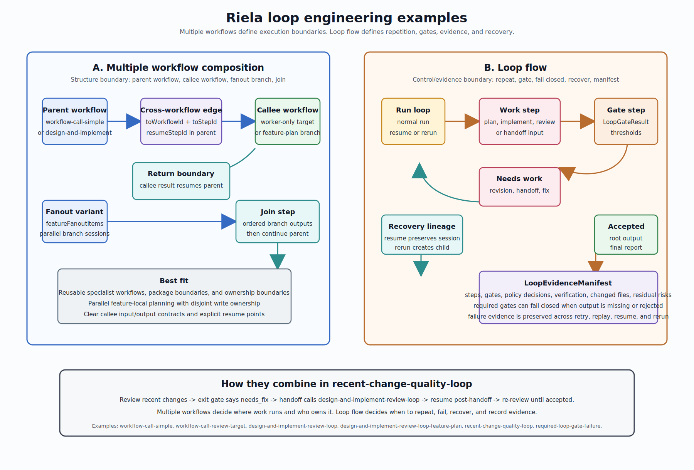

# Loop Engineering Workflow Comparison

This document explains loop engineering examples in Riela by separating two
ideas that often appear together:

- multiple workflow composition: how work is split across parent, callee,
  branch, and join boundaries
- loop flow: how a bounded engineering cycle repeats, gates output, records
  evidence, and recovers after failure

Miro board:
[Riela loop engineering comparison](https://miro.com/app/board/uXjVHBFR1I4=)

## Examples Compared

`examples/workflow-call-simple` and
`examples/workflow-call-review-target` are the smallest cross-workflow example.
The parent writes a draft, calls a worker-only review workflow through
`toWorkflowId`, `toStepId`, and `resumeStepId`, then resumes in the parent at
`apply-review`.

`examples/design-and-implement-review-loop` uses a larger parent workflow. It
can fan out feature-local planning work into
`examples/design-and-implement-review-loop-feature-plan`, then join ordered
branch outputs before continuing implementation or planning-only paths.

`examples/recent-change-quality-loop` shows the combined pattern. Its outer
loop reviews recent changes, sends the result through an exit gate, calls
`design-and-implement-review-loop` when the gate reports `needs_fix`, resumes
at `step4-post-handoff`, and then returns to `step1-review` until the gate
allows `workflow-output`.

`examples/required-loop-gate-failure` is the minimal loop-metadata example. It
declares required loop metadata and a required review gate. The gate accepts
only when the structured result reports `decision == accepted` with no high or
medium findings.

## Key Difference

Multiple workflow composition is about execution topology. It answers:

- where does this work run
- which workflow owns the step graph
- what is the callee input and output contract
- where does the parent resume
- can branches run concurrently and join later

Loop flow is about engineering control. It answers:

- should the cycle repeat
- which gate accepted or rejected the result
- what evidence proves the work happened
- what policy allowed or denied mutation, process, network, and redaction
  behavior
- how resume, rerun, retry, and replay preserve failure evidence

## Use Multiple Workflows When

Use a separate workflow when the boundary is reusable or independently owned.
This is the right shape for specialist review workers, packaged workflows,
feature-local planning branches, and parallel fanout where each branch has
disjoint write ownership.

The important fields are ordinary step transition fields:

- `toWorkflowId` selects the callee workflow
- `toStepId` selects the callee entry step
- `resumeStepId` selects where the parent continues after the callee returns
- `fanout` describes branch item selection, concurrency, join step, result
  ordering, failure policy, and write ownership

This shape does not by itself make the work a first-line engineering loop. It
creates structure and isolation, but gates and evidence still need loop
metadata or workflow-specific output contracts.

## Use Loop Flow When

Use loop flow when the important behavior is repeated plan, work, review, fix,
verify, and recover. The loop can live inside one workflow session, or it can
call other workflows for specialized work.

The important runtime concepts are:

- `WorkflowLoopMetadata` describes loop kind, required state, evidence,
  policies, gates, recovery, and implementation plan requirements
- step-level loop metadata marks gate steps and evidence-producing steps
- `LoopGateResult` records decision, severity counts, blocking findings,
  evidence refs, residual risks, and diagnostics
- `LoopEvidenceManifest` records workflow source, policy decisions, recovery
  lineage, steps, gates, artifacts, changed files, commands, verification,
  implementation plans, residual risks, and redaction status
- `LoopRecoveryLineage` records normal run, resume, rerun, retry, and replay
  relationships without erasing the original failure evidence

Required loop gates fail closed when required gate data is missing, invalid, or
outside the authored acceptance thresholds.

## Combined Pattern

`recent-change-quality-loop` is the clearest combined example:

1. Run an outer quality loop.
2. Review recent committed and uncommitted changes.
3. Route review output into an exit gate.
4. If the gate says `needs_fix`, call `design-and-implement-review-loop`.
5. Resume at `step4-post-handoff`.
6. Re-run the review step.
7. Exit only when the gate no longer reports `needs_fix`.

In this shape, the cross-workflow call chooses the implementation worker
boundary, while the loop controls repetition and exit.

## Practical Rule

Choose multiple workflows for boundary management. Choose loop flow for
engineering assurance. Use both when a repeatable engineering cycle needs to
delegate part of the work to a reusable workflow while keeping one auditable
outer loop.

## Implementation Anchors

- `design-docs/specs/design-loop-engineering-first-line-tool.md`
- `design-docs/specs/design-loop-engineering-first-line-tool-detail.md`
- `design-docs/specs/design-workflow-json.md`
- `Sources/RielaCore/LoopEngineeringModels.swift`
- `Sources/RielaCore/LoopEvidenceManifest.swift`
- `Sources/RielaCore/LoopEvidenceProjector.swift`
- `Sources/RielaCore/LoopGateResult.swift`
- `Sources/RielaCore/LoopRecoveryLineage.swift`
- `Sources/RielaCLI/LoopCommands.swift`
