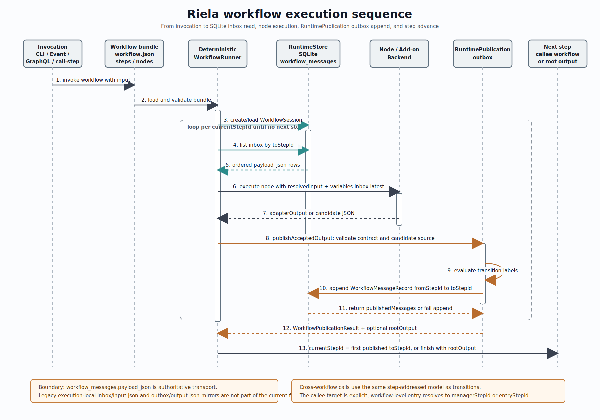

# Riela Workflow Internals

This document captures the current workflow execution shape: how workflows are
called, how authored workflow structure is interpreted, and how the runtime
uses the SQLite-backed inbox/outbox message flow.

Miro board:
[Riela workflow execution sequence](https://miro.com/app/board/uXjVHBHAx7I=)

## Execution Flow

Workflow execution can enter through the CLI (`workflow run`, resume, rerun),
event listeners, GraphQL `executeWorkflow`, or explicit control-plane step
calls such as `call-step` and `workflow-call`.

The runtime first loads the authored workflow bundle. The current source of
truth is `workflow.json`, with `entryStepId`, optional `managerStepId`,
`steps[]`, `nodes[]`, and each step's `transitions[]`. `steps[]` is the editor
presentation order, while `transitions[]` defines legal runtime routing.

`DeterministicWorkflowRunner` creates or resumes a `WorkflowSession`, starts at
`entryStepId`, resolves the current step input from the runtime store, executes
the step's node or add-on, publishes the accepted output, and advances by
reading the first published message's `toStepId`. The diagram is sequence-like:
the horizontal arrows show the actual call/return order for one step execution
loop.

## Cancellation

CLI signal handling cancels the running workflow task on `SIGINT` or `SIGTERM`.
Local agent, command, and container processes terminate their process group or
process with `SIGTERM` and then schedule a best-effort `SIGKILL` if the child is
still running.

Cancellation is a terminal workflow result. When cancellation reaches the
runner, `WorkflowRuntimeStore.markSessionFailed` marks the session `failed`,
updates any running step execution to `failed`, records the failure reason
`workflow run cancelled`, and emits the terminal session-completed event with
failed status. If cancellation happens after a transition is published but
before the next step execution starts, the session still becomes failed while
the already completed execution and queued message remain recorded.

## Inbox And Outbox Boundary

`workflow_messages` is the durable transport boundary between steps. A
`WorkflowMessageRecord` stores the workflow execution id, communication id,
`fromStepId`, `toStepId`, routing scope, delivery kind, source step execution
id, transition condition, `payload`, artifact refs, lifecycle status, creation
order, and creation time.

The inbox view is a query over `workflow_messages` where `toStepId` matches the
current step. The SQLite store keeps an inbox-oriented index on workflow id,
target step, lifecycle status, creation order, and communication id.

The outbox path is owned by `RuntimePublication`: accepted node output is
validated, transition labels are evaluated, and publishable transitions become
new `WorkflowMessageRecord` rows with `fromStepId` and `toStepId`. The store
also keeps an outbox-oriented index on workflow id, source step, creation order,
and communication id.

The current design does not use execution-local `inbox/input.json` or
`outbox/output.json` mirror files. `workflow_messages.payload_json` is the
authoritative message payload.

## Workflow Calls

Cross-workflow invocation uses the same step-addressed model as ordinary
transitions. A call targets an explicit step in the callee workflow. The
canonical workflow-level entry remains the callee `managerStepId`, or
`entryStepId` when the callee is worker-only.

## Implementation Anchors

- `design-docs/specs/design-workflow-json.md`
- `Sources/RielaCore/RuntimeSession.swift`
- `Sources/RielaCore/SQLiteWorkflowMessageLog.swift`
- `Sources/RielaCore/DeterministicWorkflowRunner.swift`
- `Sources/RielaCore/RuntimePublication.swift`
- `Sources/RielaCLI/ProductionNodeAdapter.swift`
